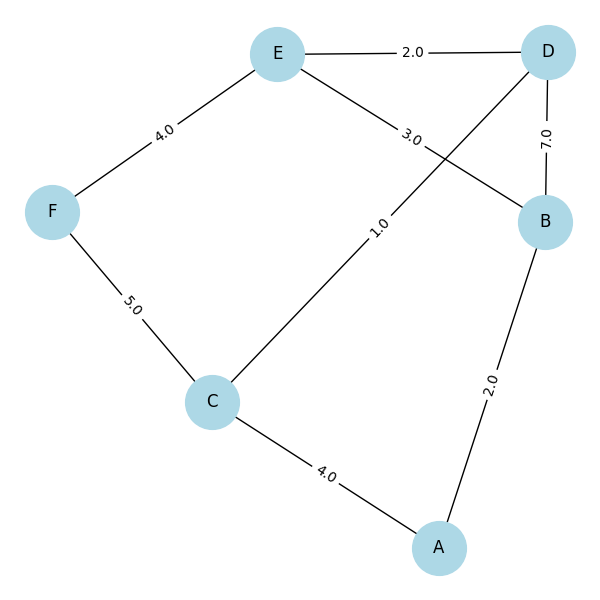
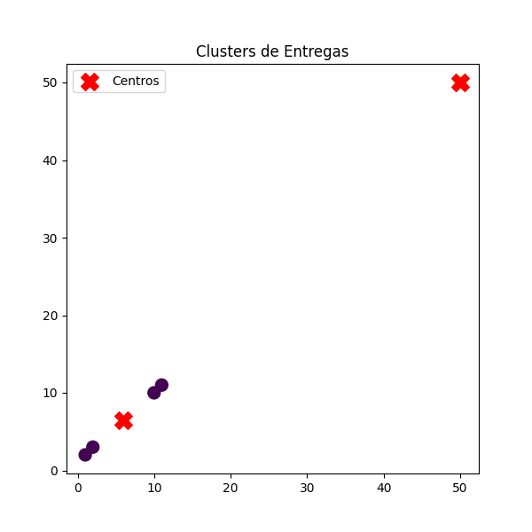
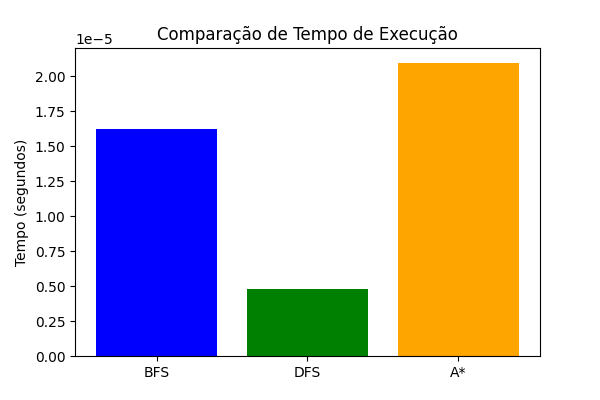
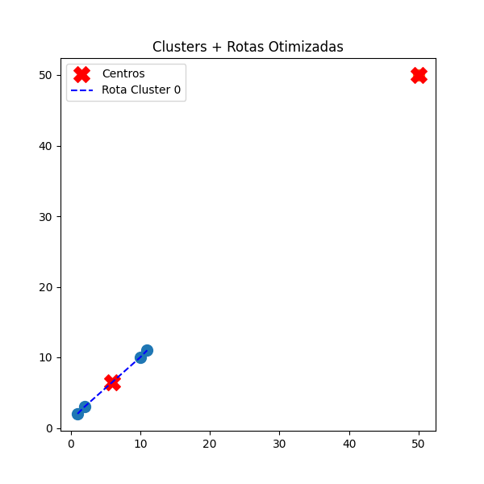

**Rota Inteligente: Otimização de Entregas com Algoritmos de IA**

## 1. Descrição do Problema
A empresa Sabor Express, localizada na região central da cidade, enfrenta dificuldades para gerenciar suas entregas em horários de pico. Atualmente, os percursos são definidos manualmente, sem apoio tecnológico, resultando em:
- Atrasos frequentes nas entregas.
- Rotas ineficientes e maior consumo de combustível.
- Insatisfação dos clientes.
Objetivo: Desenvolver uma solução baseada em Inteligência Artificial que sugira rotas otimizadas e agrupe entregas próximas, aumentando a eficiência operacional.

## 2. Abordagem Adotada
A cidade foi modelada como um grafo, onde:
- Nós (vértices): bairros ou pontos de entrega.
- Arestas: ruas conectando os pontos.
- Pesos: distância ou tempo estimado.
A solução combina:
- Algoritmos de busca para encontrar rotas eficientes.
- Clustering (K-Means) para agrupar entregas próximas em períodos de alta demanda.

## 3. Algoritmos Utilizados
   - Busca de Rotas
- BFS (Breadth-First Search): explora rotas em largura, útil para comparação.
- DFS (Depth-First Search): explora rotas em profundidade, mas menos eficiente para este caso.
- A* (A-Star): utiliza heurísticas (ex.: distância euclidiana) para encontrar o menor caminho de forma eficiente.
   - Agrupamento de Entregas
- K-Means: algoritmo de aprendizado não supervisionado que agrupa entregas próximas em clusters, otimizando o trabalho dos entregadores.

## 4. RESULTADOS EM IMAGENS

**- Diagrama do Grafo**
Este grafo representa a cidade como uma rede de pontos de entrega (nós) conectados por ruas (arestas). Os pesos nas arestas indicam a distância ou tempo estimado entre os locais. Essa visualização ajuda a entender como os algoritmos de busca percorrem o mapa para encontrar rotas eficientes.

**- Clustering de Entregas**
O gráfico mostra o agrupamento das entregas utilizando o algoritmo **K-Means**. Cada cor representa um cluster de entregas próximas, e os marcadores vermelhos em forma de "X" indicam os centros de cada grupo. Essa estratégia reduz sobreposição de trajetos e melhora a eficiência dos entregadores em horários de pico.

**- Comparação de Desempenho**
Este gráfico compara o tempo de execução dos algoritmos **BFS, DFS e A\***. Observa-se que o A* é mais eficiente, pois combina custo real e heurística, encontrando rotas curtas mais rapidamente. BFS garante o menor caminho, mas é mais lento, enquanto DFS pode se perder em trajetos longos.

**- Clusters + Rotas Otimizadas**
Aqui vemos os clusters formados pelo K-Means com rotas sugeridas dentro de cada grupo. As linhas tracejadas mostram trajetos otimizados entre pontos próximos. Essa integração entre clustering e busca de rotas demonstra como a solução pode organizar entregas em zonas e sugerir caminhos mais eficientes para cada entregador.

## 5. Resultados e Análise
    - Comparação BFS vs A*:
- BFS → garante menor caminho, mas é mais lento.
- A* → mais rápido e eficiente, ideal para cenários reais.
    - Clustering (K-Means):
- Agrupou entregas em zonas próximas, reduzindo sobreposição de rotas.
- Melhor aproveitamento dos entregadores em horários de pico.
    - Métricas
- Redução da distância total percorrida.
- Diminuição do tempo médio de entrega.
- Eficiência computacional dos algoritmos.

## 6. Limitações e Sugestões de Melhoria
    - Limitações:
- Não considera tráfego em tempo real.
- Não integra dados externos (ex.: condições climáticas).
    - Sugestões:
- Integrar APIs de trânsito (Google Maps, Waze).
- Explorar algoritmos genéticos ou aprendizado por reforço.
- Implementar otimização contínua de rotas (inspirado em UPS ORION).

## 7. Estrutura do Projeto
/sabor-express-ai
  ├── /src
  │     ├── graph.py        # Representação do grafo
  │     ├── search.py       # Algoritmos BFS, DFS, A*
  │     ├── clustering.py   # K-Means
  │     └── main.py         # Execução principal
  ├── /data
  │     └── mapa.csv        # Dados da cidade
  ├── /docs
  │     └── grafo.png       # Diagrama do grafo
  ├── README.md             # Documentação teórica
  └── requirements.txt      # Bibliotecas necessárias

## 8. Execução do Projeto
📥 Instalação
git clone https://github.com/seuusuario/sabor-express-ai
cd sabor-express-ai
pip install -r requirements.txt

- Execução
python src/main.py

## 9. Referências
- UPS ORION – Otimização de rotas em larga escala.
- Medium – “Optimizing Logistics: Clustering e MILP”.
- ResearchGate – “AI-Powered Route Optimization”.
- Kardinal.ai – Case Study “Fresh Product Delivery”.
